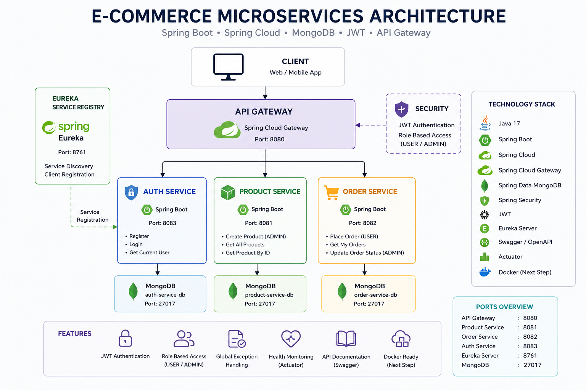
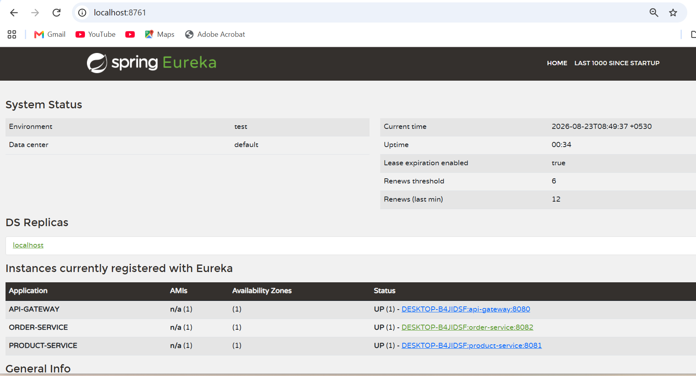
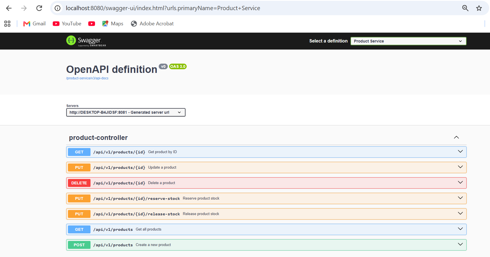
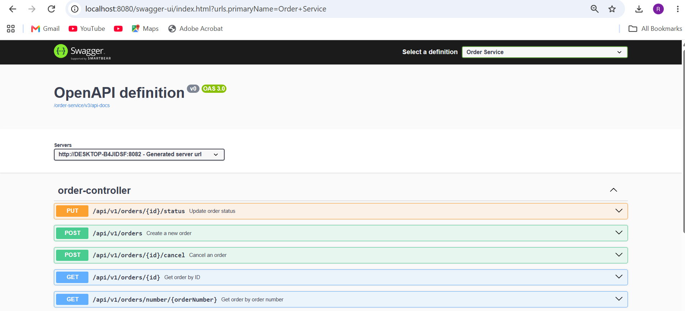
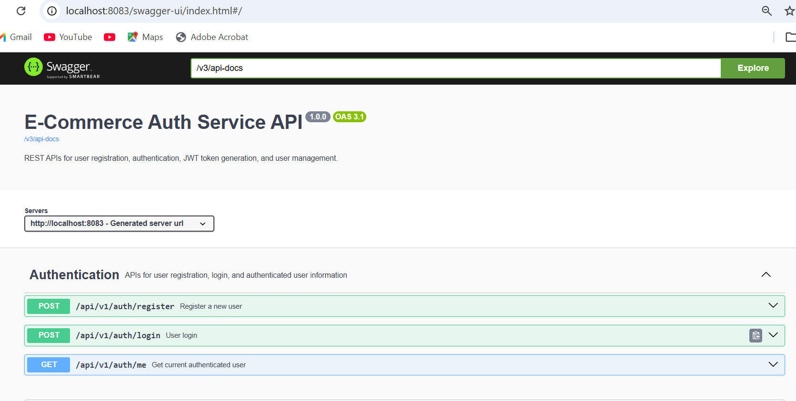
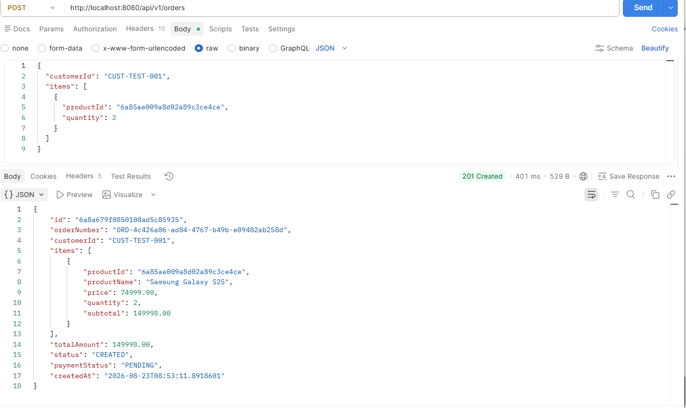

# E-Commerce Order Management System

A backend **microservices-based E-Commerce Order Management System** built with **Java 21, Spring Boot, Spring Cloud, MongoDB, Spring Security, JWT, Eureka, OpenFeign, Resilience4j, and Swagger/OpenAPI**.

The system follows a distributed microservices architecture with separate services for **authentication, product management, and order management**. The **API Gateway** acts as the single entry point for clients, providing request routing, JWT authentication, role-based authorization, and customer ID forwarding.

**Eureka Service Registry** enables service registration and discovery, while **OpenFeign** is used for communication between Order Service and Product Service. **Resilience4j** provides fault tolerance for dependent service failures.

## Services

* **Auth Service** — User registration, login, JWT token generation, and role management
* **Product Service** — Product CRUD, search, and inventory management
* **Order Service** — Order creation, retrieval, cancellation, payment, and status management
* **API Gateway** — Centralized routing, JWT authentication, authorization, and customer ID forwarding
* **Eureka Service Registry** — Service registration and discovery

The project demonstrates practical experience with **Java backend development, REST APIs, microservices, JWT authentication, role-based authorization, MongoDB, service discovery, API Gateway architecture, inter-service communication, and fault-tolerant design**.

---

## 🏗️ Architecture

The application follows a **microservices architecture** where each service is independently responsible for a specific business capability.

```text
                              ┌──────────────────────┐
                              │        Client        │
                              │   Postman / Browser  │
                              └──────────┬───────────┘
                                         │
                                         │ HTTP Requests
                                         ▼
                              ┌──────────────────────┐
                              │     API Gateway      │
                              │       :8080          │
                              │                      │
                              │ JWT Authentication   │
                              │ Role Authorization   │
                              │ Request Routing      │
                              │ Customer ID Forward  │
                              └───────┬───────┬──────┘
                                      │       │
                         ┌────────────┘       └────────────┐
                         │                                 │
                         ▼                                 ▼
                ┌──────────────────┐             ┌──────────────────┐
                │   Auth Service   │             │  Product Service │
                │                  │             │      :8081       │
                │ User Registration│             │                  │
                │ Login            │             │ Product CRUD     │
                │ JWT Generation   │             │ Search           │
                │ Role Management  │             │ Stock Management │
                └────────┬─────────┘             └────────┬─────────┘
                         │                                  │
                         ▼                                  │
                ┌──────────────────┐                         │
                │     Auth DB      │                         │
                │     MongoDB      │                         │
                └──────────────────┘                         │
                                                           │
                                                           │ OpenFeign
                                                           ▼
                                                  ┌──────────────────┐
                                                  │  Order Service   │
                                                  │      :8082       │
                                                  │                  │
                                                  │ Create Orders    │
                                                  │ My Orders        │
                                                  │ All Orders       │
                                                  │ Cancellation     │
                                                  │ Status Management│
                                                  │ Payment Status   │
                                                  └────────┬─────────┘
                                                           │
                                                           ▼
                                                  ┌──────────────────┐
                                                  │    Order DB      │
                                                  │    MongoDB       │
                                                  └──────────────────┘


                         ┌──────────────────────────────┐
                         │      Eureka Registry         │
                         │           :8761              │
                         │                              │
                         │ Service Registration         │
                         │ Service Discovery            │
                         └──────────────┬───────────────┘
                                        │
                         ┌──────────────┼──────────────┐
                         │              │              │
                         ▼              ▼              ▼
                    API Gateway    Auth Service    Product Service
                         │              │              │
                         └──────────────┴──────────────┘
                                        │
                                        ▼
                                  Order Service
```



### Architecture Components

* **Client** — Sends authentication and business API requests.
* **API Gateway** — Acts as the single entry point, validates JWT tokens, performs role-based authorization, forwards customer information, and routes requests.
* **Auth Service** — Handles user registration, login, JWT generation, and user roles.
* **Product Service** — Manages products, product search, inventory, stock reservation, and stock release.
* **Order Service** — Handles order creation, customer orders, order retrieval, cancellation, payment status, and order status management.
* **Eureka Service Registry** — Maintains service registrations and enables service discovery.
* **MongoDB** — Provides persistent data storage for the services.
* **OpenFeign** — Enables communication between Order Service and Product Service.
* **Resilience4j** — Provides fault tolerance for Product Service communication.

---

## 🔐 Authentication Flow

```text
Client
   │
   │ Register / Login
   ▼
API Gateway
   │
   ▼
Auth Service
   │
   │ Validate Credentials
   │ Generate JWT
   ▼
Client
   │
   │ Authorization: Bearer <JWT>
   ▼
API Gateway
   │
   │ Validate JWT
   │ Check Role
   │ Forward Customer ID
   ▼
Product / Order Service
```

### Authentication Process

1. The client registers or logs in through the API Gateway.
2. The API Gateway routes the request to the Auth Service.
3. The Auth Service validates the credentials.
4. A JWT token is generated and returned to the client.
5. The client includes the JWT in subsequent requests.
6. The API Gateway validates the JWT and checks the user's role.
7. For authenticated order requests, the customer ID is forwarded to the Order Service.
8. The request is routed to the appropriate backend service.

---

## 🔄 Order Communication Flow

```text
Client
   │
   │ POST /api/v1/orders
   │ Authorization: Bearer <JWT>
   ▼
API Gateway
   │
   │ JWT Authentication
   │ Role Authorization
   │ Customer ID Forwarding
   ▼
Order Service
   │
   │ Get Product
   ▼
Product Service
   │
   │ Product Details
   ▼
Order Service
   │
   │ Reserve Stock
   ▼
Product Service
   │
   │ Stock Reserved
   ▼
Order Service
   │
   │ Calculate Total
   │ Save Order
   ▼
Order MongoDB
   │
   ▼
Order Response
   │
   ▼
API Gateway
   │
   ▼
Client
```

---

## 📸 Screenshots

### Eureka Service Registry

Shows all microservices registered and running successfully.



### Product Service — Swagger

Interactive Swagger documentation for Product Service APIs.



### Order Service — Swagger

Interactive Swagger documentation for Order Service APIs.



### Auth Service — Swagger

Interactive Swagger documentation for Auth Service APIs.



### Create Order — Postman

Successful order creation through the API Gateway.



---

## ✨ Features

### 🔐 Authentication & Authorization

* User registration and login
* JWT-based authentication
* Role-based authorization with `USER` and `ADMIN` roles
* Protected API endpoints through API Gateway
* Admin-only operations for product management and order administration
* Customer ID forwarding from the authenticated JWT

### 📦 Product Management

* Create, retrieve, update, and delete products
* Product search and filtering
* Category-based filtering
* Price-range filtering
* Inventory management
* Stock reservation
* Stock release

### 🛒 Order Management

* Create orders with multiple products
* Automatic order total calculation
* Retrieve order by ID
* Retrieve order by order number
* Retrieve authenticated customer's orders
* Admin-only retrieval of all orders
* Order cancellation
* Order status management
* Payment status management
* Controlled order status transitions

### 🔗 Microservices Communication

* OpenFeign for Order Service → Product Service communication
* Eureka-based service discovery
* API Gateway as the single entry point for clients
* Independent service and database separation

### 🛡️ Reliability & Error Handling

* Resilience4j Circuit Breaker for Product Service communication
* Graceful `503 Service Unavailable` responses when dependent services are unavailable
* Global exception handling
* Request validation
* Proper HTTP error responses for invalid requests and resources

### 📚 API & Monitoring

* Swagger/OpenAPI documentation
* Spring Boot Actuator health endpoints
* Postman API testing
* Maven-based project management

---

# 🧩 Microservices

The application is divided into independent microservices, with each service responsible for a specific business capability.

### 1. Authentication Service

**Responsibilities:**

* User registration
* User login
* Credential validation
* JWT token generation
* User role management
* Providing authenticated user information

The Auth Service works with the API Gateway to secure protected endpoints using JWT-based authentication.

---

### 2. Service Registry

**Port:** `8761`

**Technology:**

* Spring Boot
* Spring Cloud Netflix Eureka Server

**Responsibilities:**

* Service registration
* Service discovery
* Maintaining the list of available service instances

**Eureka Dashboard:**

```text
http://localhost:8761
```

---

### 3. Product Service

**Port:** `8081`

**Technology:**

* Spring Boot
* Spring Data MongoDB
* MongoDB
* Validation
* Eureka Client
* Swagger/OpenAPI
* Actuator

**Responsibilities:**

* Create products
* Retrieve products
* Update products
* Delete products
* Search and filter products
* Manage inventory
* Reserve stock
* Release stock

**Database:**

```text
ecommerce_product_db
```

---

### 4. Order Service

**Port:** `8082`

**Technology:**

* Spring Boot
* Spring Data MongoDB
* MongoDB
* OpenFeign
* Eureka Client
* Resilience4j
* Validation
* Swagger/OpenAPI
* Actuator

**Responsibilities:**

* Create orders
* Retrieve orders by ID
* Retrieve orders by order number
* Retrieve authenticated customer's orders
* Retrieve all orders for administrators
* Cancel orders
* Update order status
* Update payment status
* Calculate order totals
* Communicate with Product Service
* Reserve and release product stock

**Order Access:**

```text
USER / ADMIN
    │
    └── GET /api/v1/orders/my-orders

ADMIN
    │
    └── GET /api/v1/orders/all
```

**Database:**

```text
ecommerce_order_db
```

---

### 5. API Gateway

**Port:** `8080`

**Responsibilities:**

* Single entry point for clients
* Route requests to the appropriate microservice
* Validate JWT authentication
* Enforce role-based authorization
* Forward authenticated customer information
* Protect service endpoints from direct client access

**Gateway Endpoints:**

```text
/api/v1/auth/**
/api/v1/products/**
/api/v1/orders/**
```

The API Gateway acts as the single entry point for clients, handling authentication, authorization, customer ID forwarding, and request routing.

---

# 🛠️ Technology Stack

| Technology                  | Purpose                             |
| --------------------------- | ----------------------------------- |
| Java 21                     | Programming language                |
| Spring Boot 4.0.7           | Application framework               |
| Spring Cloud 2025.1.2       | Microservices infrastructure        |
| Spring Security             | Authentication and authorization    |
| JWT                         | Stateless authentication            |
| Spring Cloud Gateway        | API Gateway and request routing     |
| Spring Cloud Netflix Eureka | Service discovery and registration  |
| Spring Cloud OpenFeign      | Inter-service communication         |
| Resilience4j                | Circuit breaker and fault tolerance |
| Spring Data MongoDB         | Database access                     |
| MongoDB                     | NoSQL database                      |
| Swagger / OpenAPI           | API documentation and testing       |
| Spring Boot Actuator        | Health monitoring                   |
| Maven                       | Build and dependency management     |
| Git / GitHub                | Version control                     |
| Postman                     | API testing                         |

---

# 📁 Project Structure

```text
ecommerce-microservices/
│
├── auth-service/
│   ├── src/
│   │   └── main/
│   │       ├── java/
│   │       └── resources/
│   ├── pom.xml
│   └── mvnw.cmd
│
├── service-registry/
│   ├── src/
│   │   └── main/
│   │       ├── java/
│   │       └── resources/
│   ├── pom.xml
│   └── mvnw.cmd
│
├── product-service/
│   ├── src/
│   │   └── main/
│   │       ├── java/
│   │       └── resources/
│   ├── pom.xml
│   └── mvnw.cmd
│
├── order-service/
│   ├── src/
│   │   └── main/
│   │       ├── java/
│   │       └── resources/
│   ├── pom.xml
│   └── mvnw.cmd
│
├── api-gateway/
│   ├── src/
│   │   └── main/
│   │       ├── java/
│   │       └── resources/
│   ├── pom.xml
│   └── mvnw.cmd
│
├── screenshots/
│   ├── eureka-dashboard.png
│   ├── product-swagger.png
│   ├── order-swagger.png
│   └── create-order.png
│
├── architecture.png
└── README.md
```

### Service Responsibilities

```text
auth-service
    │
    └── Authentication & JWT

service-registry
    │
    └── Service Discovery

api-gateway
    │
    ├── JWT Authentication
    ├── Role Authorization
    ├── Customer ID Forwarding
    └── Request Routing

product-service
    │
    └── Product & Inventory Management

order-service
    │
    └── Order Management
```

Each microservice is independently structured with its own source code, configuration, dependencies, database ownership, and build lifecycle.

---

# 🔄 Order Processing Flow

When an authenticated customer creates an order, the request flows through the API Gateway before reaching the Order Service.

```text
Client
   │
   │ 1. Login / Register
   ▼
Auth Service
   │
   │ 2. JWT Token
   ▼
Client
   │
   │ 3. POST /api/v1/orders
   │    Authorization: Bearer <JWT>
   ▼
API Gateway
   │
   │ 4. Validate JWT
   │ 5. Check USER / ADMIN role
   │ 6. Forward Customer ID
   ▼
Order Service
   │
   │ 7. Request product details
   ▼
Product Service
   │
   │ 8. Return product information
   ▼
Order Service
   │
   │ 9. Reserve stock
   ▼
Product Service
   │
   │ 10. Stock successfully reserved
   ▼
Order Service
   │
   │ 11. Calculate total
   │ 12. Save order
   ▼
Order MongoDB
   │
   │ 13. Return order response
   ▼
API Gateway
   │
   ▼
Client
```

### Order Creation Process

1. The customer authenticates through the **Auth Service**.
2. The Auth Service generates a JWT token.
3. The client sends the JWT with the order request.
4. The API Gateway validates the JWT and checks the user's role.
5. The Gateway forwards the authenticated customer ID to the Order Service.
6. The Order Service retrieves product information from the Product Service using OpenFeign.
7. The Order Service requests stock reservation.
8. The Product Service reserves the requested inventory.
9. The Order Service calculates item subtotals and the total order amount.
10. The order is persisted in the Order MongoDB database.
11. The completed order response is returned to the client through the API Gateway.

### Order Data

The order stores:

* Product ID
* Product name
* Product price
* Quantity
* Item subtotal
* Total order amount
* Customer ID
* Order number
* Order status
* Payment status
* Creation timestamp

---

# 📦 Order Status Lifecycle

Orders follow a controlled status transition managed by the Order Service.

```text
CREATED
   │
   │ Payment completed
   ▼
CONFIRMED
   │
   ▼
PROCESSING
   │
   ▼
SHIPPED
   │
   ▼
DELIVERED
```

### Cancellation

Orders can be cancelled from supported intermediate states:

```text
CREATED ────────► CANCELLED
CONFIRMED ──────► CANCELLED
PROCESSING ─────► CANCELLED
```

### Payment Status

Payment status is maintained separately from order status:

```text
PENDING
   │
   ├────────► PAID
   │
   └────────► FAILED
                  │
                  └────► PAID

PAID ───────────► REFUNDED
                  (when a paid order is cancelled)
```

### Status Transition Rules

The Order Service validates every status transition.

| Current Status | Allowed Next Status       |
| -------------- | ------------------------- |
| `CREATED`      | `CONFIRMED`, `CANCELLED`  |
| `CONFIRMED`    | `PROCESSING`, `CANCELLED` |
| `PROCESSING`   | `SHIPPED`, `CANCELLED`    |
| `SHIPPED`      | `DELIVERED`               |
| `DELIVERED`    | None                      |
| `CANCELLED`    | None                      |

A `CREATED` order can only be confirmed after its payment status becomes `PAID`.

For example, the following transition is rejected:

```text
CREATED → SHIPPED
```

This ensures that orders progress through the expected business workflow and prevents invalid state changes.

---

# 🔗 Service Communication

The microservices communicate through the **API Gateway**, **Eureka Service Registry**, and **OpenFeign**.

### Client → API Gateway

Clients send requests to the API Gateway rather than directly accessing individual microservices.

```text
Client
   │
   │ HTTP Request + JWT
   ▼
API Gateway :8080
```

The Gateway:

* Validates JWT authentication.
* Checks `USER` and `ADMIN` roles.
* Routes requests to the appropriate microservice.
* Forwards the authenticated customer ID for customer-specific order requests.

### Gateway → Microservices

```text
                 API Gateway
                    :8080
                       │
          ┌────────────┼────────────┐
          ▼            ▼            ▼
    Auth Service   Product Service  Order Service
```

### Order Service → Product Service

The Order Service communicates with the Product Service using **Spring Cloud OpenFeign**.

```java
@FeignClient(name = "product-service")
public interface ProductServiceClient {
}
```

The Order Service uses the Product Service for:

```text
GET /api/v1/products/{id}

PUT /api/v1/products/{id}/reserve-stock

PUT /api/v1/products/{id}/release-stock
```

For example, when creating an order:

```text
Order Service
      │
      │ OpenFeign
      ▼
Product Service
      │
      ├── Get Product
      │
      ├── Reserve Stock
      │
      └── Release Stock
```

### Eureka Service Discovery

Eureka acts as the service registry.

```text
                 Eureka Registry
                      :8761
                         ▲
          ┌──────────────┼──────────────┐
          │              │              │
          ▼              ▼              ▼
     API Gateway     Auth Service   Product Service
          │                             │
          │                             │
          └──────────────┬──────────────┘
                         ▼
                   Order Service
```

Each service registers itself with Eureka. The Order Service can discover the Product Service using its service name instead of relying on a hardcoded host and port.

```text
product-service
```

This makes the architecture more flexible when service instances or deployment locations change.

---

# 🛡️ Resilience4j Circuit Breaker

The Order Service uses **Resilience4j Circuit Breaker** to handle failures when communicating with the Product Service through OpenFeign.

This prevents Product Service failures from propagating as uncontrolled errors through the Order Service.

### Failure Flow

```text
Order Service
      │
      │ OpenFeign Request
      ▼
Product Service
      │
      X Service Unavailable
      │
      ▼
Resilience4j Circuit Breaker
      │
      ▼
Fallback Handler
      │
      ▼
HTTP 503 Service Unavailable
```

When the Product Service is temporarily unavailable, the circuit breaker handles the failure and the application returns a controlled response instead of exposing a raw Feign or network exception.

### Example Response

```json
{
  "status": 503,
  "error": "Service Unavailable",
  "message": "Product Service is currently unavailable. Please try again later."
}
```

### Protected Operations

The circuit breaker is used around Product Service communication required for order processing, including:

```text
Get Product Details
        │
        ▼
Reserve Product Stock
        │
        ▼
Release Product Stock
```

This improves the system's **fault tolerance**, provides predictable error responses, and prevents temporary dependency failures from causing uncontrolled failures in the Order Service.

---

# 🗄️ MongoDB Configuration

The application uses **MongoDB** for persistent data storage. Each microservice has its own dedicated database, following the **database-per-service** principle.

### Auth Service

The Auth Service stores user and authentication-related data in its dedicated MongoDB database.

```text
Auth Service → Auth MongoDB
```

### Product Service

The Product Service stores product and inventory data in:

```text
ecommerce_product_db
```

Configuration:

```properties
spring.data.mongodb.uri=mongodb://localhost:27017/ecommerce_product_db
```

### Order Service

The Order Service stores order data in:

```text
ecommerce_order_db
```

Configuration:

```properties
spring.data.mongodb.uri=mongodb://localhost:27017/ecommerce_order_db
```

### Database Isolation

```text
┌─────────────────────────┐
│      Auth Service       │
└────────────┬────────────┘
             │
             ▼
┌─────────────────────────┐
│       Auth MongoDB      │
└─────────────────────────┘


┌─────────────────────────┐
│     Product Service     │
│         :8081           │
└────────────┬────────────┘
             │
             ▼
┌─────────────────────────┐
│  ecommerce_product_db   │
└─────────────────────────┘


┌─────────────────────────┐
│      Order Service      │
│         :8082           │
└────────────┬────────────┘
             │
             ▼
┌─────────────────────────┐
│   ecommerce_order_db    │
└─────────────────────────┘
```

This separation ensures that each service owns and manages its own data without directly accessing another service's database.

MongoDB must be running locally on:

```text
localhost:27017
```

---

# 🚀 Getting Started

## Prerequisites

Make sure the following are installed and available on your system:

* Java 21
* Maven
* MongoDB
* Git

### Verify Java

```powershell
java -version
```

The project requires **Java 21**.

### Verify Maven

```powershell
mvn -version
```

### Verify MongoDB

MongoDB should be running locally on:

```text
localhost:27017
```

Before starting the microservices, ensure that MongoDB is running successfully.

---

# ▶️ Running the Application

Start the services in the following order so that service discovery and inter-service communication are available before client requests are sent.

## 1. Start Eureka Service Registry

Open a terminal:

```powershell
cd service-registry
.\mvnw.cmd spring-boot:run
```

Eureka runs on:

```text
http://localhost:8761
```

Open the Eureka Dashboard and verify that the required services are registered.

---

## 2. Start Auth Service

Open a new terminal:

```powershell
cd auth-service
.\mvnw.cmd spring-boot:run
```

The Auth Service handles user registration, login, JWT generation, and authentication-related operations.

---

## 3. Start Product Service

Open a new terminal:

```powershell
cd product-service
.\mvnw.cmd spring-boot:run
```

Product Service runs on:

```text
http://localhost:8081
```

---

## 4. Start Order Service

Open a new terminal:

```powershell
cd order-service
.\mvnw.cmd spring-boot:run
```

Order Service runs on:

```text
http://localhost:8082
```

---

## 5. Start API Gateway

Open a new terminal:

```powershell
cd api-gateway
.\mvnw.cmd spring-boot:run
```

API Gateway runs on:

```text
http://localhost:8080
```

### Startup Order

```text
MongoDB
   │
   ▼
Eureka Registry
   │
   ├──────────────┐
   ▼              ▼
Auth Service   Product Service
   │              │
   └──────┬───────┘
          ▼
     Order Service
          │
          ▼
     API Gateway
          │
          ▼
        Client
```

Once all services are running and registered with Eureka, client requests should be sent through the **API Gateway** at:

```text
http://localhost:8080
```

---

# 🌐 API Endpoints

All client requests should preferably go through the API Gateway:

```text
http://localhost:8080
```

Authentication is handled using **JWT Bearer tokens**.

---

## 🔐 Authentication APIs

Authentication endpoints are provided by the Auth Service.

### Register User

```http
POST /api/v1/auth/register
```

### Login

```http
POST /api/v1/auth/login
```

The login response provides a JWT token that must be included when accessing protected APIs.

Example:

```http
Authorization: Bearer <JWT_TOKEN>
```

---

## 📦 Product APIs

### Create Product

**Access:** `ADMIN`

```http
POST /api/v1/products
```

Example:

```json
{
  "sku": "PHONE-001",
  "name": "Smartphone",
  "category": "Electronics",
  "description": "Test smartphone",
  "price": 25000,
  "stock": 10,
  "active": true
}
```

### Get Product

**Access:** `USER`, `ADMIN`

```http
GET /api/v1/products/{id}
```

### Search Products

**Access:** `USER`, `ADMIN`

```http
GET /api/v1/products
```

Supported query parameters:

```text
category
search
minPrice
maxPrice
```

Example:

```http
GET /api/v1/products?category=Electronics&minPrice=10000&maxPrice=50000
```

### Update Product

**Access:** `ADMIN`

```http
PUT /api/v1/products/{id}
```

### Delete Product

**Access:** `ADMIN`

```http
DELETE /api/v1/products/{id}
```

### Reserve Stock

**Access:** `USER`, `ADMIN`

```http
PUT /api/v1/products/{id}/reserve-stock
```

### Release Stock

**Access:** `USER`, `ADMIN`

```http
PUT /api/v1/products/{id}/release-stock
```

---

## 🛒 Order APIs

### Create Order

**Access:** `USER`, `ADMIN`

```http
POST /api/v1/orders
```

Example:

```json
{
  "customerId": "CUST-TEST-001",
  "items": [
    {
      "productId": "PRODUCT_ID",
      "quantity": 2
    }
  ]
}
```

### Get Order by ID

**Access:** `USER`, `ADMIN`

```http
GET /api/v1/orders/{id}
```

### Get Order by Order Number

**Access:** `USER`, `ADMIN`

```http
GET /api/v1/orders/number/{orderNumber}
```

### Get My Orders

**Access:** `USER`, `ADMIN`

Returns orders belonging to the authenticated customer.

```http
GET /api/v1/orders/my-orders
```

The customer ID is obtained from the authenticated JWT and forwarded by the API Gateway.

### Get All Orders

**Access:** `ADMIN`

Returns all orders in the system.

```http
GET /api/v1/orders/all
```

### Cancel Order

**Access:** `USER`, `ADMIN`

```http
POST /api/v1/orders/{id}/cancel
```

### Update Order Status

**Access:** `ADMIN`

```http
PUT /api/v1/orders/{id}/status
```

### Update Payment Status

**Access:** `ADMIN`

```http
PUT /api/v1/orders/{id}/payment
```

---

## 🔑 Authorization Summary

| API                   | USER | ADMIN |
| --------------------- | :--: | :---: |
| Register / Login      |   ✅  |   ✅   |
| Create Product        |   ❌  |   ✅   |
| View Products         |   ✅  |   ✅   |
| Update Product        |   ❌  |   ✅   |
| Delete Product        |   ❌  |   ✅   |
| Create Order          |   ✅  |   ✅   |
| Get Order             |   ✅  |   ✅   |
| My Orders             |   ✅  |   ✅   |
| All Orders            |   ❌  |   ✅   |
| Cancel Order          |   ✅  |   ✅   |
| Update Order Status   |   ❌  |   ✅   |
| Update Payment Status |   ❌  |   ✅   |

---

# 📖 Swagger / OpenAPI

The project uses **Swagger/OpenAPI** to provide interactive API documentation for the microservices.

Swagger allows developers to:

* View available REST endpoints
* Inspect request and response models
* Understand required parameters
* Test APIs interactively
* Verify API behavior during development
* Explore authentication, product, and order APIs

### Authentication Service

```text
http://localhost:8083/swagger-ui/index.html
```

### Product Service

```text
http://localhost:8080/swagger-ui/index.html
```

### Order Service

```text
http://localhost:8080/swagger-ui/index.html
```

### API Gateway

The API Gateway exposes the service API documentation through the configured Gateway routes.

```text
http://localhost:8080/swagger-ui/index.html
```

For protected APIs, provide the JWT token using the authorization mechanism configured in Swagger:

```text
Bearer <JWT_TOKEN>
```

---

# ❤️ Health Monitoring

The project uses **Spring Boot Actuator** to expose health and monitoring endpoints for the microservices.

### Product Service

```text
GET http://localhost:8081/actuator/health
```

### Order Service

```text
GET http://localhost:8082/actuator/health
```

### API Gateway

```text
GET http://localhost:8080/actuator/health
```

### Auth Service

```text
GET http://localhost:8083/actuator/health
```

A healthy service should return a response similar to:

```json
{
  "status": "UP"
}
```

These endpoints are useful for monitoring service availability and verifying application health during development and deployment.

---

# 🧪 Testing

The application was tested using **Postman** through the API Gateway.

Testing covered authentication, authorization, product management, order processing, service communication, and failure scenarios.

### 🔐 Authentication & Authorization

* User registration
* User login
* JWT token generation
* Access to protected endpoints with a valid JWT
* Rejection of requests without authentication
* USER and ADMIN role-based access
* USER denied access to admin-only endpoints
* ADMIN access to administrative endpoints

### 📦 Product Service

* Product creation
* Product retrieval
* Product update
* Product deletion
* Product search and filtering
* Stock reservation
* Stock release
* Invalid product ID
* Duplicate product SKU
* Request validation

### 🛒 Order Service

* Order creation
* Get order by ID
* Get order by order number
* Get authenticated customer's orders
* Get all orders for administrators
* Order cancellation
* Order status updates
* Payment status updates
* Order total calculation
* Invalid order ID
* Invalid order status transition
* Invalid payment status transition
* Duplicate products within an order
* Invalid product ID
* Insufficient product stock

### 🔗 Microservices & Gateway

* API Gateway routing
* JWT authentication at the Gateway
* Customer ID forwarding
* Eureka service registration
* Eureka service discovery
* OpenFeign communication between Order Service and Product Service

### 🛡️ Failure & Resilience Testing

* Product Service unavailable
* OpenFeign communication failure
* Resilience4j Circuit Breaker
* Controlled `503 Service Unavailable` response
* Global exception handling

### ❤️ Health Checks

Service availability was verified using Spring Boot Actuator:

```text
GET /actuator/health
```

### Testing Approach

The main request flow was tested end-to-end through:

```text
Client
   │
   ▼
API Gateway
   │
   ▼
Authentication / Authorization
   │
   ▼
Microservice
   │
   ▼
Database / Dependent Service
```

This helped verify both individual API functionality and communication between the distributed services.

---

# 🔐 Error Handling

The application uses centralized exception handling to provide consistent and meaningful error responses.

The Order Service uses `@RestControllerAdvice` to handle application-specific and unexpected exceptions.

### Common Error Responses

#### Order Not Found

When an order ID or order number does not exist:

```text
HTTP 404 NOT FOUND
```

#### Product Not Found

When an order references an invalid product:

```text
HTTP 404 NOT FOUND
```

#### Validation Error

Invalid or missing request data is rejected with an appropriate client error response.

For example, an order must contain at least one item and a valid customer ID.

```text
HTTP 400 BAD REQUEST
```

#### Unauthorized Request

Requests without valid authentication credentials are rejected:

```text
HTTP 401 UNAUTHORIZED
```

#### Access Denied

Authenticated users attempting to access an endpoint without the required role receive:

```text
HTTP 403 FORBIDDEN
```

For example, a `USER` attempting to access:

```text
GET /api/v1/orders/all
```

is denied because this endpoint requires the `ADMIN` role.

#### Dependent Service Unavailable

When the Product Service is unavailable, Resilience4j handles the failure and returns:

```text
HTTP 503 SERVICE UNAVAILABLE
```

Example:

```json
{
  "status": 503,
  "error": "Service Unavailable",
  "message": "Product Service is currently unavailable. Please try again later."
}
```

Centralized error handling prevents raw internal exceptions from being exposed directly to API clients and provides predictable responses across the application.

---

# 🔍 Example End-to-End Request

First authenticate through the Auth Service:

```text
POST http://localhost:8080/api/v1/auth/login
```

Use the returned JWT token when creating a product or order.

Create a product:

```text
POST http://localhost:8080/api/v1/products
```

Then create an order using the returned product ID:

```text
POST http://localhost:8080/api/v1/orders
```

The system processes the request as follows:

```text
Client
     ↓
API Gateway
     ↓
JWT Authentication
     ↓
Order Service
     ↓
Product Service
     ↓
Reserve Stock
     ↓
Calculate Order Total
     ↓
Save Order in MongoDB
     ↓
Return Order Response
```

---

# 🧰 Build

Build Auth Service:

```powershell
cd auth-service
.\mvnw.cmd clean package
```

Build Product Service:

```powershell
cd product-service
.\mvnw.cmd clean package
```

Build Order Service:

```powershell
cd order-service
.\mvnw.cmd clean package
```

Build API Gateway:

```powershell
cd api-gateway
.\mvnw.cmd clean package
```

Build Service Registry:

```powershell
cd service-registry
.\mvnw.cmd clean package
```

---

# 📌 Design Highlights

### Microservice Separation

Authentication, Product, and Order functionality are separated into independently deployable services.

### Service Discovery

Eureka allows services to register and discover one another without hardcoding service instance information for inter-service communication.

### API Gateway

Clients interact with a single gateway instead of communicating directly with every microservice.

### JWT Authentication

JWT provides stateless authentication while the API Gateway performs authentication and role-based authorization.

### Customer Context Forwarding

The API Gateway extracts the authenticated customer information from the JWT and forwards the customer ID to the Order Service for customer-specific operations.

### Declarative REST Communication

OpenFeign simplifies communication between Order Service and Product Service.

### Fault Tolerance

Resilience4j prevents temporary Product Service failures from causing uncontrolled failures in Order Service.

### Data Isolation

Each service owns its own database:

```text
Auth Service    → Auth MongoDB
Product Service → ecommerce_product_db
Order Service   → ecommerce_order_db
```

This follows the **database-per-service** principle and keeps service data isolated.

---

# 📈 Future Improvements

Potential future enhancements include:

* Payment Service
* Notification Service
* Kafka-based asynchronous communication
* Distributed tracing
* Centralized configuration
* Centralized logging
* Redis caching
* Automated CI/CD pipeline
* Automated integration tests
* Kubernetes deployment

---

# 🎯 Key Learning Outcomes

This project demonstrates practical experience with:

* Java backend development
* Spring Boot
* REST API development
* Spring Security
* JWT authentication
* Role-based authorization
* MongoDB
* Microservice architecture
* Service discovery
* API Gateway
* OpenFeign
* Circuit breaker pattern
* Exception handling
* API validation
* Swagger/OpenAPI
* Actuator monitoring
* Maven
* Git/GitHub
* Postman API testing

---

# 👩‍💻 Author

**Rakshitha Bai V.**

Computer Science & Engineering — Data Science

Built as a practical Java Spring Boot microservices project demonstrating backend development, distributed service communication, JWT-based security, service discovery, API Gateway architecture, role-based authorization, and fault-tolerant design.
